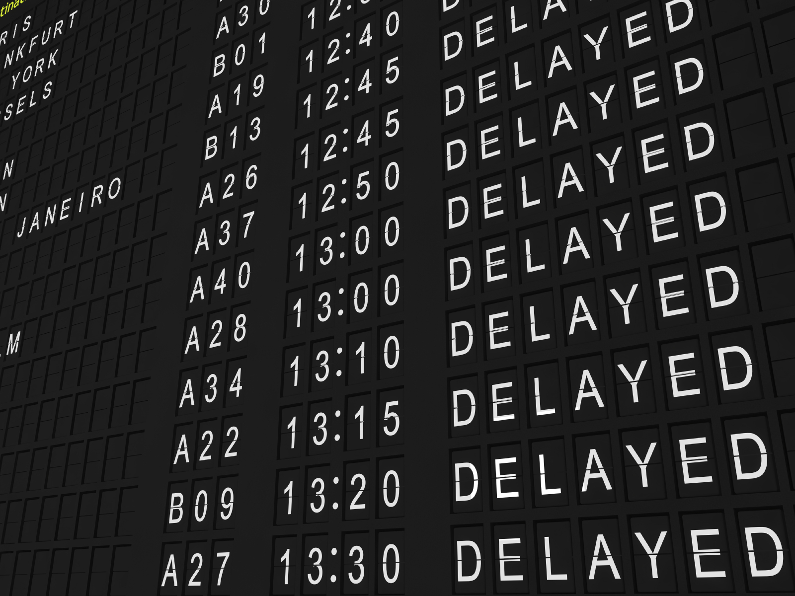

# Introduction 

In modern society, air transportation has become a vital engine driving global business, tourism, and cultural exchange. Every day, tens of thousands of flights take to the skies, linking cities, connecting families, and weaving together plans and futures. Yet, this intricate and vast system often grinds to a halt due to a familiar scene—the incessant flashing of "DELAYED" and "CANCELLED" on airport display screens.

Behind these seemingly simple words lie anxious waits, missed meetings, postponed holidays, and cascading effects rippling through the entire aviation network. Delays are never accidental; they are a "complex dance" involving airlines, airport infrastructure, air traffic systems, and weather conditions.

What allows some flights to depart on time while others remain stranded on the tarmac?
Why do delays at certain airports significantly exceed others?
And why do most cancellations point to the same cause?

To answer these questions, we did a data-driven exploration:
By analyzing flight operational data, we aim to uncover the logic behind delays, understand the vulnerabilities of the system, and identify the primary driving forces. This project will take you behind the scenes of aviation operations—from bustling runways to congested air traffic control, from the operational pressures faced by airlines to the dramatic shifts in weather systems—methodically unraveling the "true culprits" behind flight disruptions.





# Patterns 

## 1. When Delays Happen

```{python}
import pandas as pd
import matplotlib.pyplot as plt
import numpy as np

df_week = pd.read_csv("Data/3.csv")
df_daily = pd.read_csv("Data/7.csv")

plt.figure(figsize=(10,5))
plt.bar(df_week["Day"], df_week["NumFlights"])
plt.xticks(rotation=45)
plt.ylabel("Number of Flights")
plt.title("Flights by Day of Week")
plt.tight_layout()
plt.show()
```

Flight delays are not random occurrences; they tend to cluster during the system's peak operational hours.
By analyzing flight volume for each day of the week, a distinct weekly rhythm quickly emerges:

- Friday stands out as the busiest day of the week, as the return flow of business travelers converges with the outset of weekend leisure trips.
In contrast, Tuesday is the least busy, with passenger traffic at its lowest point.

- From Wednesday onward, flight volume gradually increases, building steadily until it peaks on Friday.

This recurring weekly pattern implies a critical operational insight:
During these windows of peak system congestion, even minor initial delays can be—and often are—amplified into more significant operational disruptions.


```{python}
plt.figure(figsize=(14,5))
plt.plot(df_daily["FlightDate"], df_daily["AvgPre3"])
plt.xticks(rotation=90)
plt.ylabel("3-Day Rolling Avg Flights")
plt.title("Rolling 3-Day Average Flight Volume")
plt.tight_layout()
plt.show()
```

In addition to the weekly rhythm, daily flight volumes also exhibit continuous fluctuations. To observe these underlying trends, we calculated a 3-day rolling average of daily flight numbers, which helps smooth out single-day volatility and highlight broader patterns.

The data reveals a clear "wave-like" structure in flight activity: periods of increase over several days are followed by periods of decline. A noticeable peak in traffic tends to occur around the middle of each month, while more significant dips often align with weather events or holidays.

More importantly, there is a clear correlation between higher flight volumes and system vulnerability: as the number of flights increases, so does the likelihood of delays and cancellations.

In this section, we have established a fundamental logic behind flight disruptions: it is not solely about airline operations or weather conditions, but also critically about system load.


## 2. Who Delays More

This section examines the significant variations in on-time performance among airlines. We identify which carriers have the highest delay rates and which most frequently depart ahead of schedule. This comparison provides crucial insights for understanding and navigating airline reliability.

```{python}
df_delay = pd.read_csv("Data/1.csv")   
df_early = pd.read_csv("Data/2.csv")

df_delay = df_delay.sort_values("MaxDelay", ascending=False)
df_early = df_early.sort_values("MaxEarly", ascending=False)
```

```{python}
plt.figure(figsize=(12,6))
plt.bar(df_delay["Name"], df_delay["MaxDelay"])
plt.xticks(rotation=90)
plt.ylabel("Maximum Departure Delay (minutes)")
plt.title("Maximum Departure Delay by Airline")
plt.tight_layout()
plt.show()
```
Every airline faces delays, but the maximum delay times reveal another dimension of systemic stress. For some carriers, the worst delays can stretch for hours, sometimes even approaching a full day.

- These extreme delay values typically reflect:

- Disruptions in crew scheduling

- Cascading effects from severe weather

- Severe airport congestion

- The snowball effect from long-haul flight disruptions

Such extreme incidents can significantly impact an airline's overall operational performance.

```{python}
plt.figure(figsize=(12,6))
plt.bar(df_early["Name"], df_early["MaxEarly"])
plt.xticks(rotation=90)
plt.ylabel("Maximum Early Departure (minutes)")
plt.title("Maximum Early Departure by Airline")
plt.tight_layout()
plt.show()

```

Interestingly, some airlines also record instances of early departures. This phenomenon often reflects a proactive strategy to recover from prior delays:

- Efficient ground operations

- Early arrival of preceding flights

- Air traffic control granting early release

Some carriers even achieve maximum early departure times of several tens of minutes, demonstrating strong operational recovery capability.


```{python}
df = df_delay.merge(df_early, on="Name")

# Sort by MaxDelay for better visual
df = df.sort_values("MaxDelay", ascending=True)

plt.figure(figsize=(12, 10))
y = np.arange(len(df))
plt.barh(y, df["MaxDelay"], label="Max Delay")
plt.barh(y, df["MaxEarly"], label="Max Early Departure")
plt.yticks(y, df["Name"])
plt.xlabel("Minutes")
plt.title("Airline: Maximum Delay vs Maximum Early Departure")
plt.legend()

plt.tight_layout()
plt.show()
```

When "maximum delay" and "maximum early departure" are presented side by side, a clear distribution pattern emerges among airlines:

- Some carriers exhibit both severe delays and frequent early departures, indicating significant operational volatility.(SkyWest)

- Others experience high delays with minimal early departures, suggesting weaker operational recovery capabilities.(American Airlines)

Delays and early departures do not cancel each other out; instead, they reveal distinct operational strategies across carriers.

This dual-perspective analysis demonstrates that delay patterns reflect not only operational challenges but also an airline's operational resilience.

## 3. Where Delays Happen And Why

Having analyzed airline performance, we now turn our focus to airports.

As critical nodes within the aviation network, airports are not just hubs for connectivity but also key sources where delays originate and amplify. Factors such as runway capacity, terminal efficiency, and ground handling services directly influence an airport's ability to manage traffic flow and mitigate disruptions.

```{python}
import pandas as pd
import matplotlib.pyplot as plt

df = pd.read_csv("Data/5.csv")

df["Label"] = df["Airline"] + " (" + df["Airport"] + ")"

df_sorted = df.sort_values("AvgDelay", ascending=True)

plt.figure(figsize=(12,10))
plt.barh(df_sorted["Label"], df_sorted["AvgDelay"])
plt.xlabel("Average Delay (minutes)")
plt.title("Worst-Delay Airport for Each Airline")
plt.tight_layout()
plt.show()

```

Every airline has its "worst-performing airports."
By analyzing the airports with the highest average delays for each carrier, a clear pattern emerges:
delays often originate from specific airports rather than the airlines themselves.

- Key contributing factors include:

- Insufficient number of runways

- Frequent adverse weather conditions

- Remote geographical location of the airport

This indicates that an airline’s delay performance may be significantly influenced by conditions at certain airports.

```{python}

df_total = pd.read_csv("Data/6a.csv")
df_reasons = pd.read_csv("Data/6b.csv")
reason_counts = df_reasons["Reason"].value_counts()

plt.figure(figsize=(8,8))
plt.pie(reason_counts, labels=reason_counts.index, autopct='%1.1f%%')
plt.title("Distribution of Cancellation Reasons")
plt.tight_layout()
plt.show()

```

In the composition chart of cancellation causes, one finding stands out most prominently:

- Weather accounts for an overwhelming majority of cases.

- This is followed by National Air System Delays, which refers to traffic flow restrictions managed by air traffic control.

- Meanwhile, Carrier-related issues only become a noticeable factor primarily at smaller airports.


```{python}
top10 = df_reasons.groupby("Name")["Number"].sum().sort_values(ascending=False).head(10)

top10_airports = top10.index.tolist()

df_top10 = df_reasons[df_reasons["Name"].isin(top10_airports)]

pivot = (
    df_top10.pivot_table(
        index="Name",
        columns="Reason",
        values="Number",
        aggfunc="sum",
        fill_value=0
    )
)

pivot = pivot.loc[top10_airports]

plt.figure(figsize=(12,8))

bottom = None

for reason in pivot.columns:
    if bottom is None:
        plt.barh(pivot.index, pivot[reason], label=reason)
        bottom = pivot[reason]
    else:
        plt.barh(pivot.index, pivot[reason], left=bottom, label=reason)
        bottom += pivot[reason]
plt.xlabel("Total Cancellations")
plt.title("Top 10 Airports — Cancellation Reason Breakdown")
plt.legend(title="Reason")
plt.tight_layout()
plt.show()
```

The stacked bar chart reveals the distinct drivers behind these cancellations:

- At most hubs, weather is the dominant cause

- ***During winter, Atlanta emerges as the hub most severely impacted by weather, with flight cancellation numbers significantly surpassing those of other regions. This notable spike is likely directly linked to the multiple major winter storms that struck the Southeastern United States during the winter of 2017, highlighting the systemic impact extreme weather events can have on critical aviation nodes.***

This leads to a crucial conclusion: cancellation patterns are not uniform. They are shaped by a combination of geography, traffic load, facility capacity, and local weather, giving each major airport its own unique risk profile.


# Conclusion

This analysis shows that flight delays and cancellations are not random events—they follow clear and measurable patterns.

First, air travel operates on a predictable weekly and daily rhythm.
When flight volume peaks—especially on Fridays—the entire aviation system becomes more fragile, making delays far more likely.

Second, delays are often airport-driven rather than airline-driven.
Each airline’s worst delays can be traced to specific airports, where weather, runway capacity, or congested airspace create persistent bottlenecks.

Third, cancellations across the U.S. are overwhelmingly caused by weather.
For the busiest airports, even minor storms or visibility issues can trigger widespread disruptions.

Together, these findings reveal a simple truth:

Flight disruptions are systemic, not accidental—shaped by traffic volume, airport constraints, and weather.